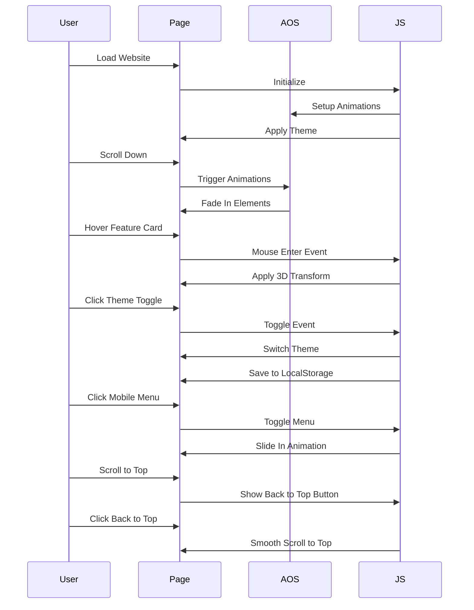
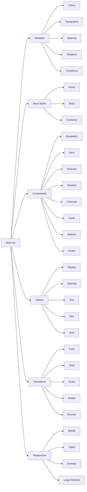
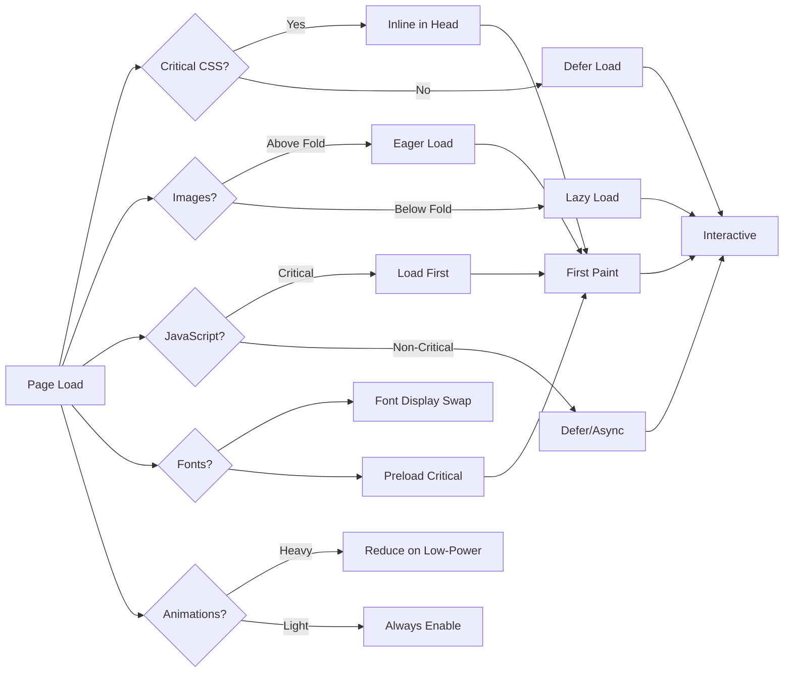
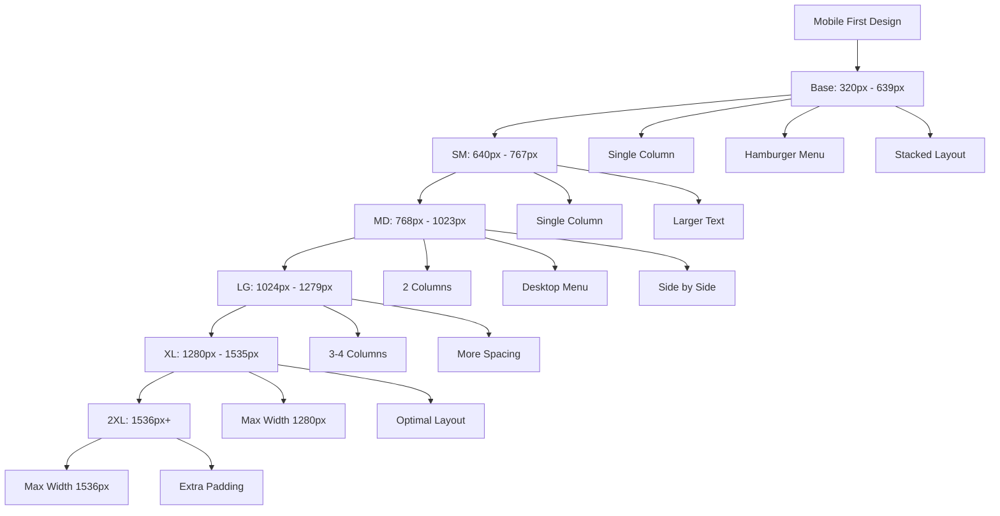
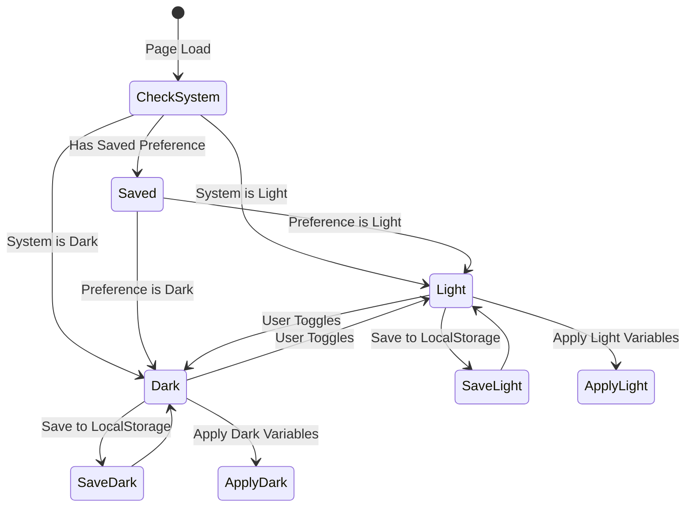
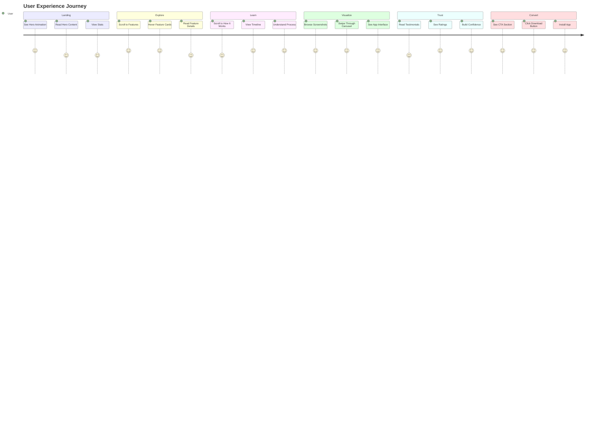
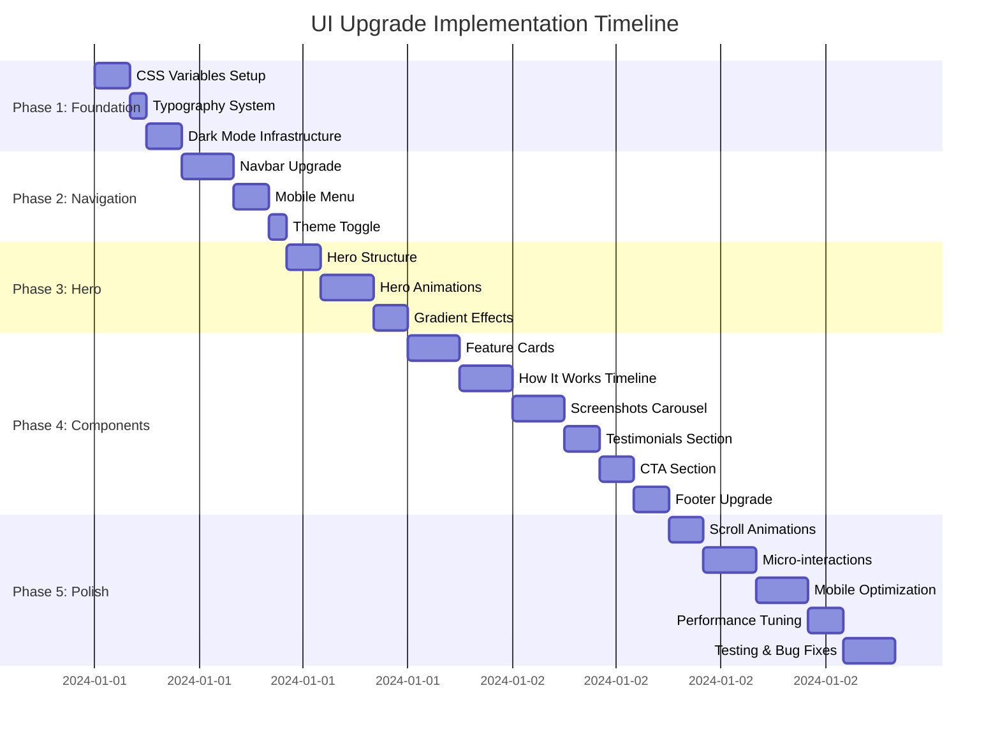

# Sơ Đồ Kiến Trúc UI Upgrade

## 1. Component Hierarchy

```mermaid
graph TD
    A[Website Root] --> B[Navigation]
    A --> C[Hero Section]
    A --> D[Features Section]
    A --> E[How It Works]
    A --> F[Screenshots]
    A --> G[Testimonials]
    A --> H[CTA Section]
    A --> I[Footer]
    
    B --> B1[Logo]
    B --> B2[Menu Items]
    B --> B3[Theme Toggle]
    B --> B4[Mobile Toggle]
    
    C --> C1[Background Effects]
    C --> C2[Hero Content]
    C --> C3[Hero Image]
    C --> C4[Scroll Indicator]
    
    C1 --> C1A[Gradient Orbs]
    C1 --> C1B[Particles]
    
    C2 --> C2A[Badge]
    C2 --> C2B[Title]
    C2 --> C2C[Subtitle]
    C2 --> C2D[CTA Buttons]
    C2 --> C2E[Stats]
    
    D --> D1[Feature Card 1]
    D --> D2[Feature Card 2]
    D --> D3[Feature Card 3]
    D --> D4[Feature Card 4]
    
    D1 --> D1A[Icon Wrapper]
    D1 --> D1B[Title]
    D1 --> D1C[Description]
    D1 --> D1D[Hover Overlay]
    
    E --> E1[Timeline Item 1]
    E --> E2[Timeline Item 2]
    E --> E3[Timeline Item 3]
    E --> E4[Timeline Item 4]
    
    F --> F1[Swiper Container]
    F1 --> F1A[Slides]
    F1 --> F1B[Navigation]
    F1 --> F1C[Pagination]
    
    G --> G1[Testimonial Card 1]
    G --> G2[Testimonial Card 2]
    G --> G3[Testimonial Card 3]
    
    I --> I1[Wave Divider]
    I --> I2[Footer Columns]
    I --> I3[Social Links]
    I --> I4[Back to Top]
```



## 2. Animation Flow



## 3. CSS Architecture



## 4. JavaScript Module Structure

```mermaid
graph TD
    A[main.js] --> B[Navigation Module]
    A --> C[Theme Module]
    A --> D[Animations Module]
    A --> E[Carousel Module]
    A --> F[Interactions Module]
    
    B --> B1[Sticky Header]
    B --> B2[Mobile Menu]
    B --> B3[Smooth Scroll]
    B --> B4[Active Link]
    
    C --> C1[Toggle Theme]
    C --> C2[Save Preference]
    C --> C3[Apply Theme]
    C --> C4[Detect System Theme]
    
    D --> D1[Initialize AOS]
    D --> D2[Scroll Animations]
    D --> D3[Number Counter]
    D --> D4[Text Reveal]
    
    E --> E1[Initialize Swiper]
    E --> E2[Autoplay Control]
    E --> E3[Navigation Setup]
    
    F --> F1[Button Ripple]
    F --> F2[Card Tilt]
    F --> F3[Back to Top]
    F --> F4[Form Validation]
```



## 5. Performance Optimization Flow



## 6. Responsive Breakpoint Strategy



## 7. Dark Mode Implementation



## 8. User Interaction Journey



## 9. File Structure

```
website/
├── index.html (Updated)
├── privacy-policy.html (Style Updates)
├── terms-of-service.html (Style Updates)
├── support.html (Style Updates)
├── delete-account.html (Style Updates)
├── css/
│   └── style.css (Complete Rewrite)
├── js/
│   └── main.js (Enhanced)
├── images/
│   ├── app-mockup.png (New)
│   ├── avatars/ (New)
│   │   ├── user-1.jpg
│   │   ├── user-2.jpg
│   │   └── user-3.jpg
│   └── screenshots/ (Existing)
│       ├── screen-1.png
│       ├── screen-2.png
│       └── screen-3.png
└── plans/
    ├── ui-upgrade-plan.md
    └── ui-architecture-diagram.md
```

## 10. Implementation Timeline



---

**Tổng thời gian ước tính:** Khoảng 45-50 giờ làm việc cho một developer có kinh nghiệm.

**Lưu ý:** Sơ đồ này mang tính chất tham khảo và có thể điều chỉnh tùy theo tốc độ implement thực tế.